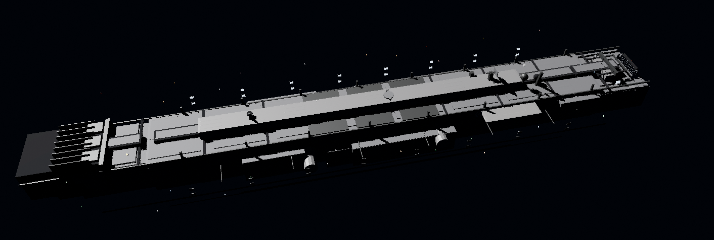

<div align="center">

# Blender Skills

**23 Specialized Skills for Blender Artists.**
**Transform Claude Code and Cursor into your Senior Technical Art team — not a tutorial bot.**

[](version.json)
[](LICENSE)
[](.claude/skills/)
[](docs/BLENDER_MCP_SETUP.md)
[](https://docs.anthropic.com/en/docs/claude-code)

</div>

---

## Quick Start

```bash
/plugin marketplace add arjun988/blender-skills
/plugin install blender-skills@arjun988
```

For all installation methods and first steps, see the **[Quick Start Guide](QUICKSTART.md)**.

**Full documentation:** [SKILLS_GUIDE.md](SKILLS_GUIDE.md)

---

## Skills (23)

23 specialized skills across 5 categories covering every stage of a production Blender pipeline.

See **[Skills Guide](SKILLS_GUIDE.md)** for the full list, decision trees, and workflow combinations.

### Usage Patterns

#### Orchestrated Execution

The **blender-director** skill analyzes your request and routes automatically:

```
# Hard Surface Asset
"Build a game-ready sci-fi rifle for Unreal Engine, 3k tris, realistic PBR"
→ blender-director → hard-surface → uv-workflow → materials → asset-optimization → export-pipeline

# Environment
"Create a modular horror corridor kit — narrow, flickering fluorescent, Silent Hill feel"
→ blender-director → horror-style → environment-artist → lighting → export-pipeline

# Character
"Retopologize this creature sculpt for game animation, 15k triangle budget"
→ blender-director → retopology → uv-workflow → texture-workflow → rigging
```

#### Reference Image Matching

Attach a photo or concept art and the agent matches it:

```
"Match this reference — industrial spaceship, analyze first then build in Blender"
→ blender-director → reference-image-match
  → Camera match → Geometry tiers → Materials → Lighting → Screenshot comparison loop
```

### Skill Categories

| Category | Skills |
|----------|--------|
| **Orchestration** | [blender-director](.claude/skills/blender-director/) |
| **Modeling** | [blender-modeler](.claude/skills/blender-modeler/), [hard-surface](.claude/skills/hard-surface/), [environment-artist](.claude/skills/environment-artist/), [character-artist](.claude/skills/character-artist/), [creature-artist](.claude/skills/creature-artist/) |
| **Production Workflow** | [sculpting](.claude/skills/sculpting/), [retopology](.claude/skills/retopology/), [uv-workflow](.claude/skills/uv-workflow/), [materials](.claude/skills/materials/), [texture-workflow](.claude/skills/texture-workflow/) |
| **Technical** | [geometry-nodes](.claude/skills/geometry-nodes/), [lighting](.claude/skills/lighting/), [rendering](.claude/skills/rendering/), [animation](.claude/skills/animation/), [rigging](.claude/skills/rigging/) |
| **Pipeline** | [procedural-modeling](.claude/skills/procedural-modeling/), [asset-optimization](.claude/skills/asset-optimization/), [export-pipeline](.claude/skills/export-pipeline/) |
| **Style** | [horror-style](.claude/skills/horror-style/), [lowpoly-style](.claude/skills/lowpoly-style/), [stylized-style](.claude/skills/stylized-style/), [realistic-style](.claude/skills/realistic-style/) |

---

## Blender MCP

Every skill executes **directly in Blender** via MCP — no UI walkthroughs, no manual steps.

```
Blender (running) ← BlenderMCP addon ← Claude Code / Cursor
```

**Setup in 4 steps:**

1. Install [uv](https://docs.astral.sh/uv/getting-started/installation/)
2. Install the [BlenderMCP addon](https://github.com/ahujasid/blender-mcp) in Blender
3. Blender sidebar `N` → **BlenderMCP** → **Connect to Claude**
4. Restart Cursor — `.cursor/mcp.json` is preconfigured

Full guide: **[docs/BLENDER_MCP_SETUP.md](docs/BLENDER_MCP_SETUP.md)**

| Config File | Client |
|-------------|--------|
| `.cursor/mcp.json` | Cursor (project) |
| `.mcp.json` | Claude Code (project) |

---

## Workflow Pipelines

### Hero Hard Surface Prop
```
blender-director → hard-surface → uv-workflow → materials → asset-optimization → export-pipeline
```

### Game Character
```
blender-director → character-artist → sculpting → retopology
→ uv-workflow → texture-workflow → rigging → animation → export-pipeline
```

### Horror Environment
```
blender-director → horror-style → environment-artist → lighting
→ lowpoly-style → asset-optimization → export-pipeline
```

### Modular Kit
```
blender-director → environment-artist → geometry-nodes
→ uv-workflow → texture-workflow → asset-optimization → export-pipeline
```

### Reference Image Match
```
blender-director → reference-image-match.md
  → Reference Analysis → Camera match → Geometry tiers
  → Materials → Lighting → Screenshot compare loop
  → visual-match-checklist → validation-checklist
```

---

## Philosophy

Every skill in this pack:

- **Thinks before acting** — Plans the full pipeline before touching Blender
- **Executes via MCP** — Uses Blender MCP tools when connected, never narrates UI steps
- **Matches references** — Analyzes photo first, camera-matches, screenshot-compares in a loop
- **Follows production standards** — Naming conventions, polycount budgets, game-ready output
- **Validates before export** — Asset optimization and checklist gate on every delivery

---

## Project Structure

```
.claude-plugin/           # Claude Code plugin manifest
.claude/skills/           # 23 skills + 40 shared reference files
  ├── blender-director/
  ├── hard-surface/
  ├── environment-artist/
  ├── ... (20 more skills)
  └── references/         # Asset pipeline, naming, MCP tools, checklists
.cursor/mcp.json          # Blender MCP config (Cursor)
.mcp.json                 # Blender MCP config (Claude Code)
docs/
  └── BLENDER_MCP_SETUP.md
```

---

## Documentation

| Doc | Purpose |
|-----|---------|
| [QUICKSTART.md](QUICKSTART.md) | Installation and first steps |
| [SKILLS_GUIDE.md](SKILLS_GUIDE.md) | Skill index, decision trees, workflows |
| [docs/BLENDER_MCP_SETUP.md](docs/BLENDER_MCP_SETUP.md) | Blender MCP connection guide |
| [CONTRIBUTING.md](CONTRIBUTING.md) | How to add skills and contribute |
| [CHANGELOG.md](CHANGELOG.md) | Version history |
| [.claude/skills/references/](.claude/skills/references/) | Shared pipeline standards |

---

## Contributing

See **[CONTRIBUTING.md](CONTRIBUTING.md)** for guidelines on adding skills, writing references, and submitting pull requests.

---

## Changelog

See **[CHANGELOG.md](CHANGELOG.md)** for full version history and release notes.

---

## License

MIT License — See [LICENSE](LICENSE) for details.

---

## Support

- **Issues:** [GitHub Issues](https://github.com/arjun988/blender-skills/issues)
- **Discussions:** [GitHub Discussions](https://github.com/arjun988/blender-skills/discussions)
- **Repository:** [github.com/arjun988/blender-skills](https://github.com/arjun988/blender-skills)

---

<div align="center">

**Built for Claude Code and Cursor** | **Blender MCP Integration** | **23 Skills** | **40 Reference Files**

Inspired by [jeffallan/claude-skills](https://github.com/Jeffallan/claude-skills)

</div>
